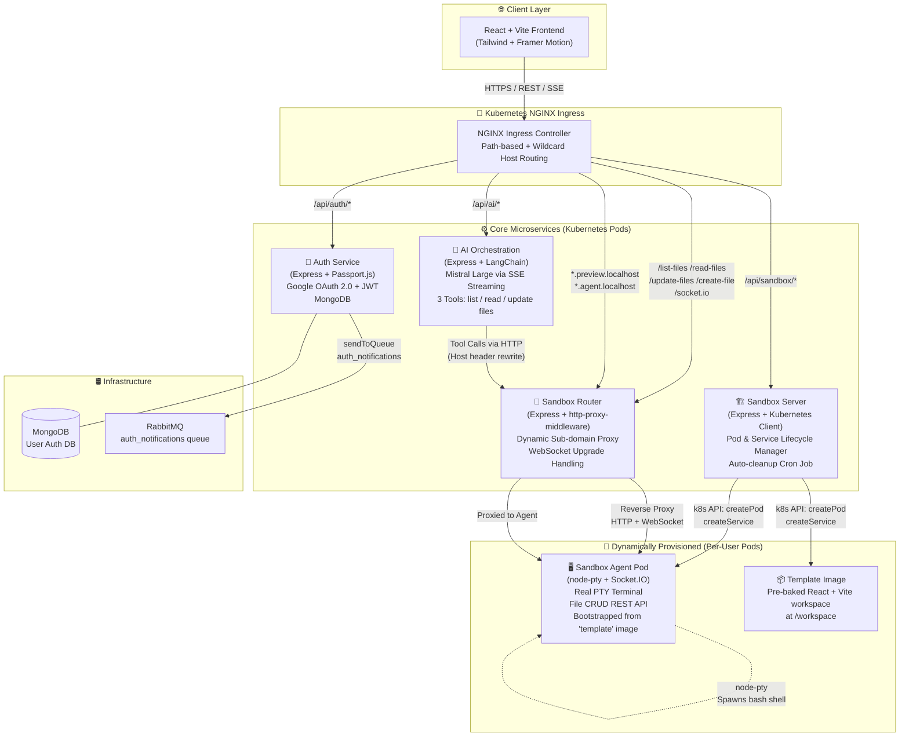

# CodeSpace — AI-Powered Cloud Development Sandbox

[](https://nodejs.org)
[](https://react.dev)
[](https://kubernetes.io)
[](https://docker.com)
[](https://langchain.com)
[](https://mistral.ai)
[](https://rabbitmq.com)

> **CodeSpace** is a production-grade, cloud-native platform that provisions isolated, on-demand development sandboxes inside Kubernetes Pods. Each sandbox is equipped with a real Linux terminal (via `node-pty`), a live file system, and a dedicated **AI Copilot agent** (powered by Mistral Large via LangChain) that can autonomously read, create, and modify files in the user's workspace — all streamed in real-time over Server-Sent Events (SSE).

---

## Table of Contents

1. [System Architecture](#system-architecture)
2. [Service Overview](#service-overview)
3. [Microservices Deep Dive](#microservices-deep-dive)
   - [Auth Service](#1-auth-service)
   - [Sandbox Server](#2-sandbox-server)
   - [Sandbox Agent](#3-sandbox-agent)
   - [Sandbox Router](#4-sandbox-router)
   - [AI Orchestration Service](#5-ai-orchestration-service)
   - [Frontend (React + Vite)](#6-frontend-react--vite)
4. [Kubernetes Infrastructure](#kubernetes-infrastructure)
5. [Request Routing & Ingress](#request-routing--ingress)
6. [Async Messaging (RabbitMQ)](#async-messaging-rabbitmq)
7. [Tech Stack](#tech-stack)
8. [Local Development](#local-development)
9. [Environment Variables](#environment-variables)
10. [Architecture Decisions](#architecture-decisions)

---

## System Architecture

The platform follows a **polyglot microservices architecture** orchestrated on Kubernetes. Each concern is isolated into its own container with clearly defined responsibilities, inter-service communication patterns, and independent scaling.



---

## Service Overview

| Service | Image | Port | Replicas | Key Responsibility |
|---|---|---|---|---|
| `auth` | `auth:latest` | 3000 | 1 | Google OAuth, JWT issuance, user persistence |
| `sandbox` | `sandbox:latest` | 3000 | 1 | Dynamically provision/destroy K8s Pods & Services |
| `ai-orchestration` | `ai-orchestration:latest` | 3000 | **2** | LangChain agent — stream AI responses via SSE |
| `router` | `router:latest` | 3000 | 1 | Reverse-proxy + WebSocket upgrade by sub-domain |
| `agent` *(dynamic)* | `agent:latest` | 3000 | N (per-user) | PTY terminal, file system REST API, Socket.IO |
| `template` *(dynamic)* | `template:latest` | — | N (per-user) | Pre-baked React+Vite `/workspace` volume |
| `frontend` | Vite SPA | 5173 / 80 | — | React dashboard, IDE UI, AI Copilot chat |

---

## Microservices Deep Dive

### 1. Auth Service

**Path:** [`/auth`](./auth)

Handles all identity concerns for the platform.

| Detail | Value |
|---|---|
| Framework | Express 5 |
| Auth Strategy | Google OAuth 2.0 via `passport-google-oauth20` |
| Session | Stateless JWT stored in HTTP-only cookies |
| Database | MongoDB via Mongoose |
| Async Events | Publishes to RabbitMQ `auth_notifications` queue on login |
| CORS | Configured for `cryboy.in`, `localhost:5173`, `localhost` |

**Key files:**
- [`app.js`](./auth/app.js) — Express server, Passport strategy setup
- [`config/db.js`](./auth/config/db.js) — Mongoose connection
- [`config/mq.js`](./auth/config/mq.js) — RabbitMQ channel, queue assertion & publisher
- [`routes/auth.routes.js`](./auth/routes/auth.routes.js) — OAuth callback routes
- [`models/user.model.js`](./auth/models/user.model.js) — Mongoose user schema

**Auth flow:**
```
Browser → GET /api/auth/google
        → Google OAuth Consent Screen
        → GET /api/auth/google/callback
        → JWT issued → Cookie set
        → Redirect to /?auth=success
        → RabbitMQ auth_notifications event published
```

---

### 2. Sandbox Server

**Path:** [`/sandbox/server`](./sandbox/server)

The **control plane** for sandbox lifecycle. Uses the official `@kubernetes/client-node` SDK to programmatically create and destroy Kubernetes Pods and Services on demand.

| Detail | Value |
|---|---|
| Framework | Express |
| K8s Client | `@kubernetes/client-node` |
| RBAC | `resource-manager` ServiceAccount with Pod & Service CRUD permissions |
| Pod Images | `template:latest` (workspace) + `agent:latest` (terminal + file API) |
| Cleanup | Background `setInterval` cron every 10 min — deletes Pods inactive for > 1 hour |

**Key files:**
- [`src/app.js`](./sandbox/server/src/app.js) — REST API + auto-cleanup scheduler
- [`src/kubernestes/pod.js`](./sandbox/server/src/kubernestes/pod.js) — `createPod` / `deletePod`
- [`src/kubernestes/service.js`](./sandbox/server/src/kubernestes/service.js) — `createService` / `deleteService`
- [`src/kubernestes/config.js`](./sandbox/server/src/kubernestes/config.js) — K8s client initialization (in-cluster config)

**Sandbox provisioning flow:**
```
POST /api/sandbox/start
  → Generate UUID (sandboxId)
  → createPod(sandboxId)      ← mounts template image as initContainer
  → createService(sandboxId)  ← unique ClusterIP per sandbox
  → Return { sandboxId, previewUrl: http://<id>.preview.localhost }
```

Each sandbox gets a **unique ClusterIP Service** named `sandbox-service-<id>`, enabling the Router to proxy HTTP and WebSocket traffic to it by sub-domain.

---

### 3. Sandbox Agent

**Path:** [`/sandbox/agent`](./sandbox/agent)

Runs **inside every dynamically-created Pod**. Provides two core capabilities:

#### A. Real PTY Terminal (Socket.IO)
Uses `node-pty` to spawn a real `bash` process inside the container. Terminal I/O is bidirectionally streamed over Socket.IO:
```
Browser Socket.IO
  → NGINX Ingress (/socket.io)
  → Router (WebSocket upgrade handler)
  → Agent Socket.IO
  → node-pty bash process
```

#### B. File System REST API
Exposes the `/workspace` directory over HTTP, enabling the AI Orchestration service to read and mutate the user's project files:

| Endpoint | Method | Description |
|---|---|---|
| `/list-files` | `GET` | Recursively lists all files (excl. `node_modules`, `.git`, `dist`) |
| `/read-files?files=a,b` | `GET` | Returns file contents as JSON |
| `/update-files` | `PATCH` | Overwrites file contents (auto-creates missing directories) |
| `/create-file` | `POST` | Creates new files or directories |

**Key file:** [`src/app.js`](./sandbox/agent/src/app.js)

---

### 4. Sandbox Router

**Path:** [`/sandbox/router`](./sandbox/router)

A **smart reverse proxy** that routes both HTTP and WebSocket traffic to the correct agent Pod based on sub-domain parsing.

| Detail | Value |
|---|---|
| Framework | Express + `http-proxy-middleware` |
| Preview routing | `<sandboxId>.preview.localhost` → sandbox preview server port |
| Agent routing | `<sandboxId>.agent.localhost` → agent REST API + Socket.IO |
| WebSocket | Manual `server.on('upgrade')` handler for protocol upgrade proxying |

**Sub-domain parsing logic:**
```javascript
// host: "019e5b5c.agent.localhost"
const parts = host.split('.');
sandboxId  = parts[0]; // "019e5b5c"
domainType = parts[1]; // "agent" | "preview"
```

The router resolves the per-sandbox Kubernetes Service by name and proxies traffic accordingly, handling both standard HTTP requests and raw WebSocket upgrades.

**Key files:**
- [`server.js`](./sandbox/router/server.js) — HTTP server + WebSocket upgrade handler
- [`src/app.js`](./sandbox/router/src/app.js) — Express app, proxy middleware registration

---

### 5. AI Orchestration Service

**Path:** [`/ai-orchestration`](./ai-orchestration)

The brain of the AI Copilot. Runs a **LangChain ReAct agent** backed by **Mistral Large** that can autonomously build and modify code in the user's workspace using tool calls — all streamed to the browser via **Server-Sent Events (SSE)**.

| Detail | Value |
|---|---|
| Framework | Express |
| LLM | `mistral-large-latest` via `@langchain/mistralai` |
| Agent | LangChain `createAgent` (ReAct loop) |
| Streaming | SSE — named events: `tool`, `answer`, `summary`, `error` |
| Replicas | **2** (stateless, horizontally scalable) |
| Recursion limit | 100 tool-call iterations per session |

**Agent Tools:**

| Tool | Name | Description |
|---|---|---|
| `listFiles` | `list_files` | Lists all files in the sandbox workspace |
| `readFiles` | `read_files` | Reads contents of specified file paths |
| `updateFiles` | `update_files` | Writes / creates files with new content |

Tools communicate with the sandbox agent via HTTP through the Router, using **Host header rewriting** to make internal K8s traffic work without wildcard DNS resolution inside the cluster:

```javascript
// *.localhost sub-domains don't resolve inside K8s — rewrite to router-service
config.headers['Host'] = '<sandboxId>.agent.localhost';
parsedUrl.hostname = 'router-service'; // ClusterIP DNS
config.url = parsedUrl.toString();
```

**Agent persona (`FrontendForge`):**  
A senior frontend engineer persona that builds polished, production-quality React websites. It follows a strict `UNDERSTAND → PLAN → EXPLORE → BUILD → POLISH → REPORT` workflow and only ships code — never describes it.

**Key files:**
- [`src/agents/code.agent.js`](./ai-orchestration/src/agents/code.agent.js) — Agent definition, system prompt, tool binding, recursion limit
- [`src/agents/tools.js`](./ai-orchestration/src/agents/tools.js) — Tool implementations with K8s-aware HTTP routing
- [`src/routes/agent.route.js`](./ai-orchestration/src/routes/agent.route.js) — SSE streaming endpoint handler

---

### 6. Frontend (React + Vite)

**Path:** [`/frontend`](./frontend)

A single-page application with three distinct UI layers:

| View | Description |
|---|---|
| **Landing Page** | Animated hero with rotating orbit icons (Framer Motion), key stats, launch CTA |
| **Auth Page** | Google OAuth login flow component |
| **Dashboard** | Sandbox management — start/delete pods, live creation logs via console panel |
| **Workspace IDE** | VS Code-like layout: file explorer, code editor, terminal, AI Copilot chat panel |

**Key dependencies:**
- `framer-motion` — Smooth page transitions and orbital animations
- `react-markdown` — Renders AI Copilot markdown responses in chat
- `lucide-react` — Icon system
- `tailwindcss` — Utility-first styling

**AI Copilot SSE stream parsing (frontend):**
```javascript
event: tool    → Show tool activity log in chat panel
event: answer  → Display AI text response (markdown rendered)
event: summary → Trigger workspace file tree refresh
event: error   → Display error message to user
```

---

## Kubernetes Infrastructure

All manifests live in [`/k8s`](./k8s) and are deployed together via **Skaffold** ([`skaffold.yml`](./skaffold.yml)).

```
k8s/
├── auth-deployment.yml       # Auth service Pod spec
├── auth-service.yml          # ClusterIP Service for auth
├── ai-deployment.yml         # AI service — 2 replicas, Gemini + Mistral API key secrets
├── ai-service.yml            # ClusterIP Service for AI
├── sandbox-deployment.yml    # Sandbox server — resource-manager ServiceAccount
├── sandbox-service.yml       # ClusterIP Service for sandbox
├── router-deployment.yml     # Router — liveness & readiness probes
├── router-service.yml        # ClusterIP Service for router
├── ingress.yml               # NGINX Ingress — path prefix + wildcard host rules
└── rbac.yml                  # ServiceAccount, Role, RoleBinding for K8s API access
```

### RBAC Configuration

The Sandbox Server dynamically calls the Kubernetes API to provision user environments. This is secured via a minimal, least-privilege RBAC setup:

```yaml
# rbac.yml
ServiceAccount: resource-manager

Role: resource-manager
  resources: [pods, services]
  verbs: [create, get, list, watch, delete]

RoleBinding: resource-manager-binding
  → Binds ServiceAccount to Role
```

`sandbox-deployment.yml` sets `serviceAccountName: resource-manager` so only the Sandbox Server Pod inherits these permissions.

### Resource Limits

| Service | CPU Request | CPU Limit | Mem Request | Mem Limit |
|---|---|---|---|---|
| `sandbox` | 250m | 500m | 200Mi | 400Mi |
| `ai-orchestration` | 250m | 500m | 128M | 256M |
| `router` | 250m | 500m | 255M | 512M |

All deployments include **liveness** and **readiness probes** on `/api/status/healthz` and `/api/status/readyz` with `initialDelaySeconds: 90` to account for container startup time.

---

## Request Routing & Ingress

The NGINX Ingress Controller handles all external traffic and routes it to the correct service based on **path prefix** or **wildcard hostname**:

```
Incoming Request                         Routed To
─────────────────────────────────────────────────────────────────────────
/api/auth/*                          →   auth-service:80
/api/sandbox/*                       →   sandbox-service:80
/api/ai/*                            →   ai-service:80
/list-files                          →   router-service:80
/read-files                          →   router-service:80
/update-files                        →   router-service:80
/create-file                         →   router-service:80
/socket.io                           →   router-service:80
*.preview.localhost  (wildcard host)  →   router-service:80
*.agent.localhost    (wildcard host)  →   router-service:80
```

The Router then performs the **final hop** — it parses the sub-domain to identify the target sandbox Pod and proxies the request. Timeout values are set to `6000s` to support long-running SSE and WebSocket connections.

---

## Async Messaging (RabbitMQ)

The Auth Service publishes events to RabbitMQ, decoupling identity events from downstream consumers:

```
Auth Service
  └─► connectMQ()
        └─► amqp.connect(RABBITMQ_URL)
        └─► channel.assertQueue('auth_notifications', { durable: true })
  └─► sendAuthNotification(message)
        └─► channel.sendToQueue(Buffer.from(JSON.stringify(message)))
```

The `auth_notifications` queue is declared **durable** — messages survive broker restarts without loss. The Notification Service ([`/notification`](./notification)) is the designated consumer for this queue.

---

## Tech Stack

| Layer | Technology |
|---|---|
| **Frontend** | React 18, Vite, Tailwind CSS, Framer Motion, Lucide React |
| **Auth** | Node.js, Express 5, Passport.js (Google OAuth 2.0), JWT, MongoDB, Mongoose |
| **Sandbox Control Plane** | Node.js, Express, `@kubernetes/client-node`, UUID v7 |
| **Sandbox Agent** | Node.js, Express, `node-pty`, Socket.IO |
| **Sandbox Router** | Node.js, Express, `http-proxy-middleware` |
| **AI Orchestration** | Node.js, Express, LangChain, Mistral Large (`mistral-large-latest`) |
| **Async Messaging** | RabbitMQ, `amqplib` |
| **Containerisation** | Docker |
| **Orchestration** | Kubernetes 1.28, NGINX Ingress Controller |
| **Dev Workflow** | Skaffold (`skaffold/v4beta13`) |
| **Secrets Management** | Kubernetes Secrets (`ai-database`, `sandbox-database`) |

---

## Local Development

### Prerequisites

- [Docker Desktop](https://www.docker.com/products/docker-desktop/) with Kubernetes enabled
- [Skaffold CLI](https://skaffold.dev/docs/install/)
- [NGINX Ingress Controller](https://kubernetes.github.io/ingress-nginx/deploy/) installed in the cluster
- Wildcard DNS entries for `*.preview.localhost` and `*.agent.localhost` pointing to `127.0.0.1`
- Node.js 22+ (for standalone frontend dev)

### Start the full stack with Skaffold

```bash
# 1. Clone the repository
git clone <repo-url>
cd Capstone

# 2. Create Kubernetes secrets
kubectl create secret generic ai-database \
  --from-literal=GEMINI_API_KEY=<your-key> \
  --from-literal=MISTRALAI_API_KEY=<your-key>

kubectl create secret generic sandbox-database \
  --from-literal=SANDBOX_DB_URL=<optional>

# 3. Build all Docker images, apply all K8s manifests, and watch for file changes
skaffold dev
```

**Skaffold builds these images:**

| Artifact | Context |
|---|---|
| `auth` | `./auth` |
| `ai-orchestration` | `./ai-orchestration` |
| `agent` | `./sandbox/agent` |
| `router` | `./sandbox/router` |
| `sandbox` | `./sandbox/server` |
| `template` | `./sandbox/template` |

### Frontend (standalone dev)

```bash
cd frontend
npm install
npm run dev
# → http://localhost:5173
```

---

## Environment Variables

### Auth Service (`/auth/.env`)

| Variable | Description |
|---|---|
| `AUTH_MONGO_URI` | MongoDB connection URI |
| `GOOGLE_CLIENT_ID` | Google OAuth 2.0 Client ID |
| `GOOGLE_CLIENT_SECRET` | Google OAuth 2.0 Client Secret |
| `RABBITMQ_URL` | RabbitMQ connection URL (e.g. `amqp://localhost`) |
| `JWT_SECRET` | Secret key for signing JWTs |
| `PORT` | Server port (default: `3000`) |

### AI Orchestration (K8s Secret: `ai-database`)

| Variable | Description |
|---|---|
| `GEMINI_API_KEY` | Google Gemini API key |
| `MISTRALAI_API_KEY` | Mistral AI API key |
| `SANDBOX_SERVICE_URL_TEMPLATE` | URL template for sandbox agent (default: `http://sandbox-service-${projectId}:3000`) |

### Sandbox Server (K8s Secret: `sandbox-database`)

| Variable | Description |
|---|---|
| `IMAGE_NAME_template` | Docker image name for the template container (`template`) |
| `IMAGE_NAME_agent` | Docker image name for the agent container (`agent`) |

---

## Architecture Decisions

| Decision | Rationale |
|---|---|
| **Per-sandbox Kubernetes Pod** | True process + filesystem isolation; no shared state between users |
| **Wildcard sub-domain routing** | Clean UX for preview URLs; enables transparent WebSocket proxying without path conflicts |
| **SSE for AI streaming** | Simpler than WebSockets for unidirectional server-push; works natively through standard HTTP proxies |
| **Host header rewriting in AI tools** | `*.localhost` sub-domains don't resolve inside the cluster; rewriting to `router-service` makes internal K8s DNS work seamlessly |
| **LangChain ReAct agent** | Tool-calling loop gives the AI full autonomy to explore, plan, and modify the workspace in multiple steps before responding |
| **RBAC least-privilege** | Sandbox server only gets `pods` and `services` CRUD — no cluster-admin access |
| **Durable RabbitMQ queue** | Decouples auth events from downstream services; survives broker restarts without message loss |
| **2 AI service replicas** | AI inference is stateless and compute-bound; horizontal scaling distributes concurrent user sessions |
| **Auto-cleanup cron job** | Prevents resource leaks by destroying sandbox Pods/Services idle for more than 1 hour |
